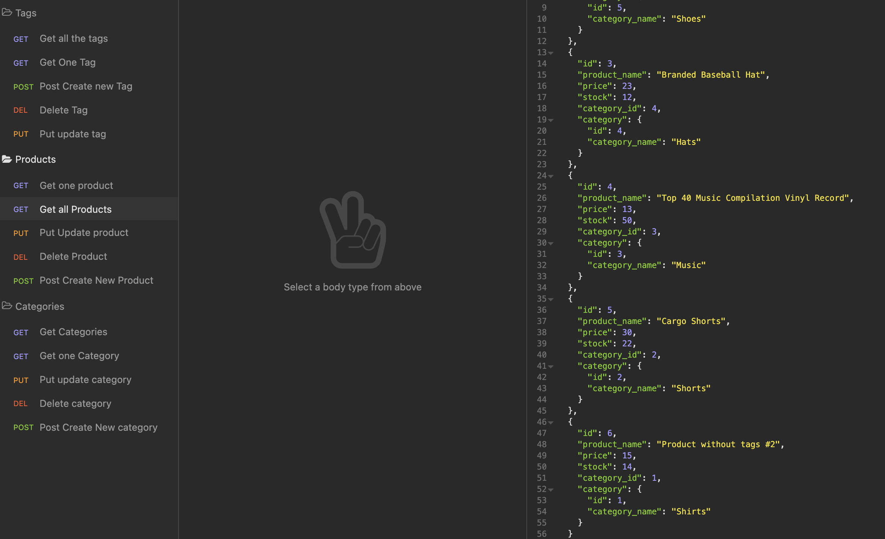

# e-commerce-back-end

## Relevant Links

Please find the relevant links here:

- Repository on Github: [Click Here](https://github.com/alexanderpuschkinberlin/e-commerce-back-end)

## Description

This is a javascript backend implementation of an ecommerce system. Using express API and sequelize to access the data from a MySQL Database and interact the backend.

## Technologies used:

- Javascript
- Node.js
- Express Package
- MySQL2 Package
- API

## Screenshot



## Instructions :

- Clone this repository to use this application on local machine.

- To install necessary dependencies, run the following command:

```
npm i
```

- Make sure a MySQL database instance is running
- run the schema.sql to prepare the database and its tables
- run "npm run seed" to polulate the data
- The application will start with the following command:

```
node main.js or npm run start
```

---

© 2022 Alexander Puschkin | All Rights Reserved.
